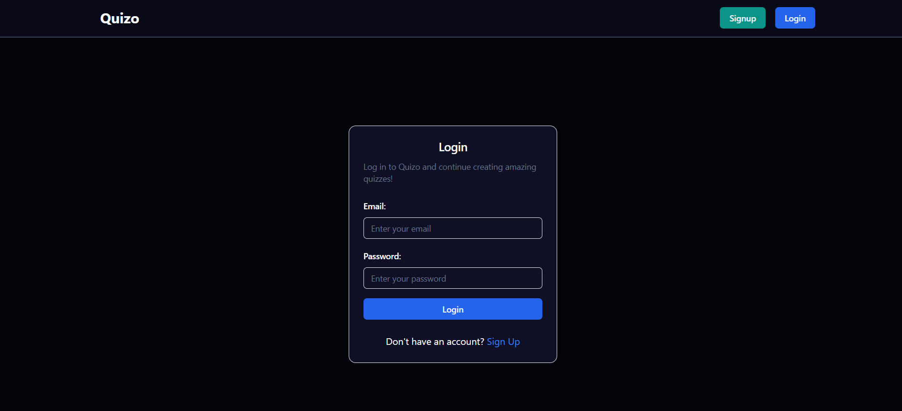
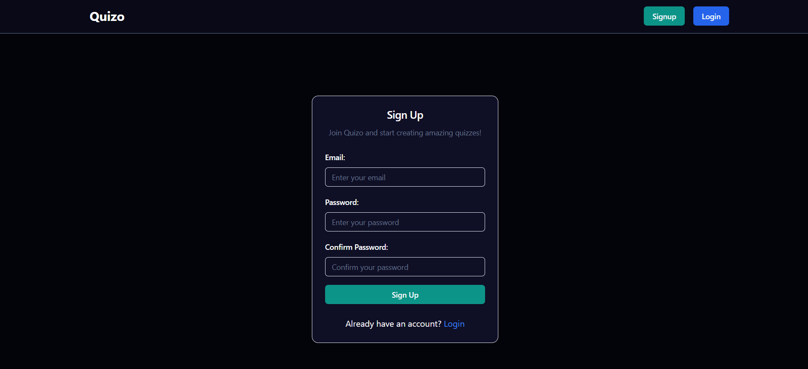
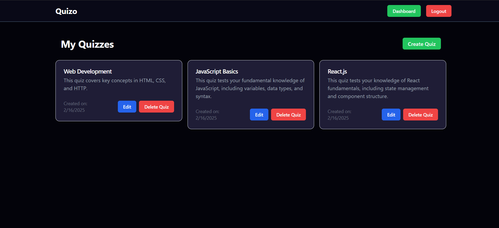
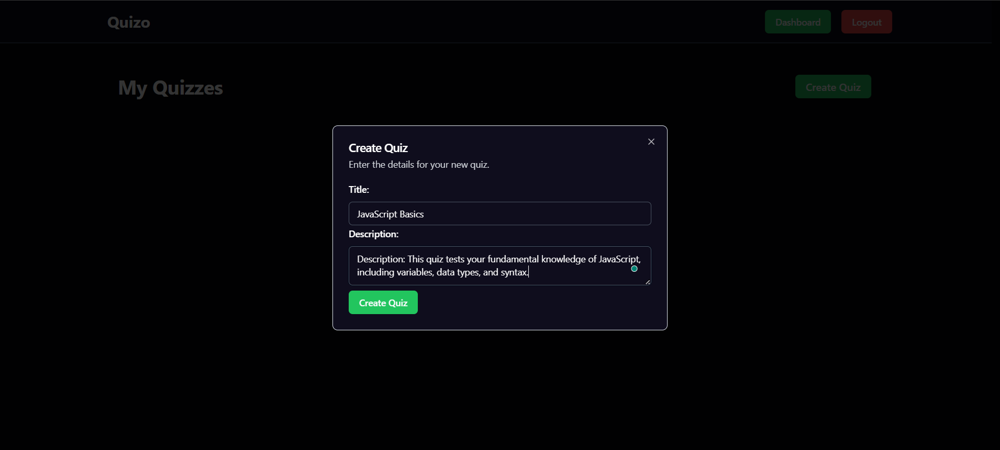
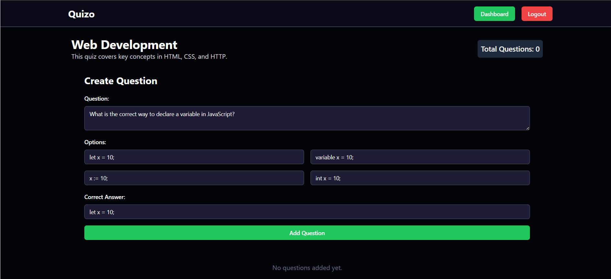
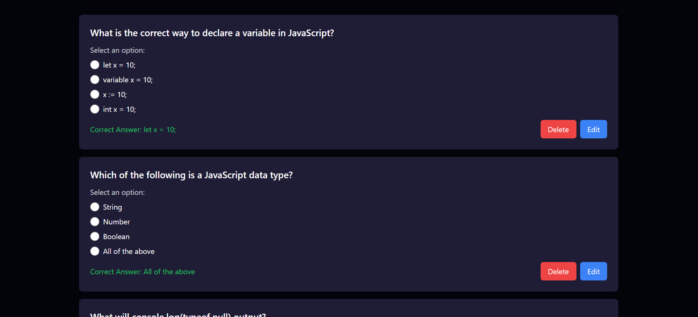

# Quiz App - Full Stack Project

This is a full-stack quiz application built with React (frontend) and Node.js/Express (backend). Users can sign up, log in, create quizzes, and manage questions for each quiz.

## Project Setup Instructions

### Prerequisites

Ensure you have the following installed:

- Node.js
- npm

### Backend Setup

1. Clone the repository:
   ```sh
   git clone https://github.com/avinashkt04/quizo-app.git
   cd quiz-app/server
   ```
2. Install dependencies:
   ```sh
   npm install
   ```
3. Create a `.env` file and add the following environment variables:
   ```env
   DATABASE_URL=
   NODE_ENV="development"
   CORS_ORIGIN=http://localhost:5173
   ```
4. Start the backend server:
   ```sh
   npm start
   ```
  
The backend server should now be running on `http://localhost:3000`

### Frontend Setup

1. Navigate to the frontend directory:
   ```sh
   cd ../frontend
   ```
2. Install dependencies:
   ```sh
   npm install
   ```
3. Create a `.env` file and add the following environment variable:
   ```env
   VITE_BASE_URL=http://localhost:3000/api/v1
   ```
4. Start the frontend server:
   ```sh
   npm run dev
   ```

The frontend should now be running on `http://localhost:5173`

---

## Features

- **User Authentication:** Sign up, login, logout
- **Dashboard:** View all quizzes
- **Quiz Management:** Create, edit, delete quizzes
- **Question Management:** Add, edit, delete questions within a quiz
- **Real-time Updates:** Navigate between quiz and question management seamlessly

---

## API Documentation

### **User Routes** (`/api/v1/users`)

| Method | Endpoint      | Description                    |
| ------ | ------------- | ------------------------------ |
| POST   | `/signup`     | Register a new user            |
| POST   | `/signin`     | Log in a user                  |
| POST   | `/signout`    | Log out a user (protected)     |
| GET    | `/getuser`    | Get user details (protected)   |
| GET    | `/check-auth` | Check if user is authenticated |

### **Quiz Routes** (`/api/v1/quizzes`)

| Method | Endpoint           | Description                         |
| ------ | ------------------ | ----------------------------------- |
| POST   | `/create-quiz`     | Create a new quiz (protected)       |
| GET    | `/get-quizzes`     | Get all quizzes (protected)         |
| GET    | `/get-quiz/:id`    | Get a single quiz by ID (protected) |
| PUT    | `/edit-quiz/:id`   | Edit a quiz by ID (protected)       |
| DELETE | `/delete-quiz/:id` | Delete a quiz by ID (protected)     |

### **Question Routes** (`/api/v1/`)

| Method | Endpoint                       | Description                              |
| ------ | ------------------------------ | ---------------------------------------- |
| POST   | `/:quizId/add-question`        | Add a question to a quiz (protected)     |
| GET    | `/:quizId/get-questions`       | Get all questions for a quiz (protected) |
| PUT    | `/:quizId/edit-question/:id`   | Edit a question (protected)              |
| DELETE | `/:quizId/delete-question/:id` | Delete a question (protected)            |

---

## Screenshots


### Login Page



### Signup Page



### Dashboard Page





### Quiz Page



